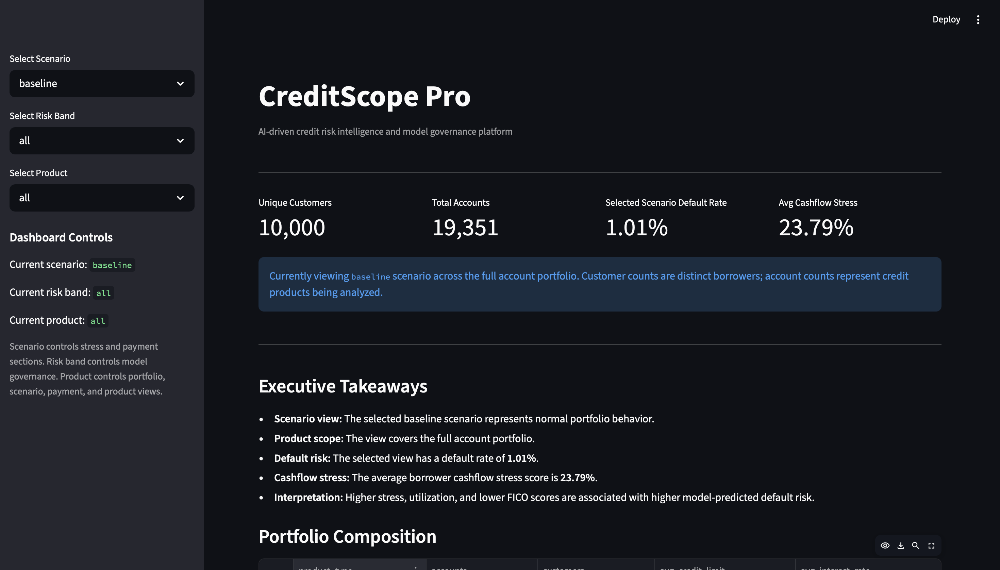
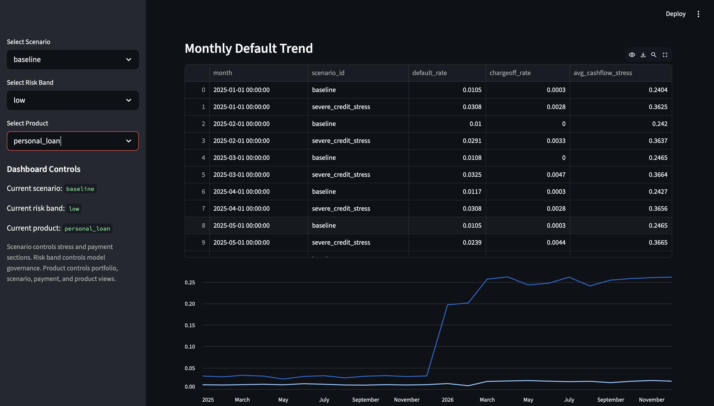
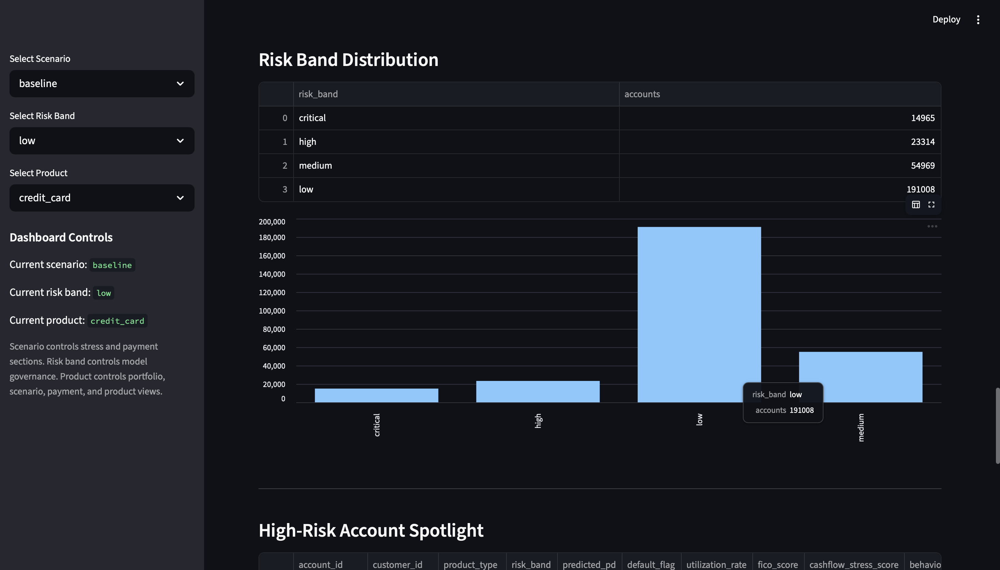

# CreditScope Pro

CreditScope Pro is an AI-driven credit risk intelligence and model governance platform. It simulates a synthetic credit portfolio, models borrower behavior under macroeconomic stress scenarios, predicts default risk, and displays executive-ready risk insights through an interactive dashboard.

This project is designed as a full-stack FinTech analytics portfolio project, combining synthetic data engineering, DuckDB analytics, machine learning, model governance, and Streamlit dashboarding.

---

## Project Overview

CreditScope Pro answers questions like:

* How does portfolio risk change under macroeconomic stress?
* Which products show higher default concentration?
* Which accounts should analysts review first?
* How do payment behaviors change under stress scenarios?
* How well do model risk bands separate actual default risk?

The system creates a synthetic lending portfolio with customers, accounts, macro conditions, stress scenarios, payment events, bureau profiles, model predictions, and audit records.

---

## Key Features

* Synthetic customer and credit account generation
* Macro-economic stress scenario simulation
* Monthly account-level behavior modeling
* Payment event generation
* Bureau-style customer credit profiles
* Logistic Regression default prediction model
* Risk band assignment and model audit table
* Executive Streamlit dashboard
* Product, scenario, and risk band filters
* High-risk account spotlight table
* Risk band distribution and default trend views

---

## Tech Stack

| Layer                    | Tools                                     |
| ------------------------ | ----------------------------------------- |
| Data Generation          | Python, NumPy, Pandas                     |
| Analytical Database      | DuckDB                                    |
| Machine Learning         | Scikit-learn Logistic Regression          |
| Dashboard                | Streamlit                                 |
| Backend-ready Foundation | Python scripts, modular project structure |
| Environment              | VS Code, virtual environment              |

---

## Project Structure

```text
creditscope-pro/
│
├── data/
│   └── duckdb/
│       └── creditscope.duckdb
│
├── src/
│   ├── data_generation/
│   │   ├── generate_customers.py
│   │   ├── generate_accounts.py
│   │   ├── generate_macro.py
│   │   ├── generate_policy_scenarios.py
│   │   ├── generate_behavior.py
│   │   ├── generate_payment_events.py
│   │   └── generate_bureau_monthly.py
│   │
│   ├── database/
│   │   ├── schema.sql
│   │   └── build_duckdb.py
│   │
│   ├── models/
│   │   ├── create_modeling_dataset.py
│   │   ├── train_logistic_model.py
│   │   ├── score_model_audit.py
│   │   └── portfolio_summary.py
│   │
│   └── dashboard/
│       └── app.py
│
├── requirements.txt
├── README.md
└── .gitignore
```

---

## Data Architecture

CreditScope Pro uses a relational DuckDB architecture with the following main tables:

| Table                       | Purpose                                                             |
| --------------------------- | ------------------------------------------------------------------- |
| `customers`                 | Borrower demographic, income, credit, and resilience profile        |
| `accounts`                  | Credit products linked to customers                                 |
| `macro_monthly`             | Monthly macroeconomic conditions by region                          |
| `policy_scenarios`          | Configurable economic stress scenarios                              |
| `account_monthly_snapshots` | Monthly account behavior, stress, delinquency, and default outcomes |
| `payment_events`            | Payment-level events such as late, missed, and partial payments     |
| `bureau_monthly`            | Customer-level bureau-style credit profile over time                |
| `modeling_dataset`          | Machine-learning-ready baseline dataset                             |
| `model_scoring_audit`       | Model predictions, risk bands, and governance fields                |

---

## Current Dataset Scale

The current Version 1 synthetic portfolio includes:

| Dataset                   |    Rows |
| ------------------------- | ------: |
| Customers                 |  10,000 |
| Accounts                  |  19,351 |
| Macro Monthly             |     864 |
| Policy Scenarios          |     120 |
| Account Monthly Snapshots | 928,848 |
| Payment Events            | 928,848 |
| Bureau Monthly            | 240,000 |
| Modeling Dataset          | 464,424 |
| Model Scoring Audit       | 464,424 |

---

## Modeling Approach

The first model is a Logistic Regression classifier trained to predict account-level default risk using baseline portfolio behavior.

The model uses features such as:

* utilization rate
* days past due
* cashflow stress score
* behavioral risk score
* macro stress score
* interest rate
* FICO score
* debt balance
* credit utilization
* income
* employment type
* product type
* risk tier

The model outputs:

* predicted probability of default
* risk band: low, medium, high, critical
* model audit records for governance tracking

---
## Demo and Access

CreditScope Pro is currently maintained as a portfolio-grade prototype and product concept.

The repository includes the core application structure, data generation modules, modeling scripts, and dashboard code. The generated DuckDB database and synthetic data outputs are intentionally excluded from version control.

For review purposes, the dashboard screenshots below show the current working prototype. The project can be demonstrated locally upon request.

### Local Development Note

The application is designed to run locally with Python, DuckDB, and Streamlit. Full reproduction requires generating the synthetic portfolio, rebuilding the DuckDB database, creating the modeling dataset, and launching the dashboard.

A more deployment-ready version with packaged setup scripts, API endpoints, and hosted dashboard access is planned for future iterations.

## Example Insights

CreditScope Pro can show insights such as:

* severe credit stress increases default and charge-off rates compared with baseline
* high-risk model bands have meaningfully higher actual default concentration
* payment delays increase under stress scenarios
* accounts with lower FICO and higher utilization are more likely to fall into critical risk bands
* product-level risk differs across credit cards, auto loans, personal loans, and student refinance products

---

## Dashboard

The Streamlit dashboard includes:

* executive KPI cards
* scenario filter
* product filter
* risk band filter
* executive takeaways
* portfolio composition
* scenario risk comparison
* monthly default trend
* payment behavior by scenario
* model risk band validation
* risk band distribution
* high-risk account spotlight
* product-level baseline risk

### Dashboard Preview







Run the dashboard with:

```bash
streamlit run src/dashboard/app.py
```

---


## Future Improvements

Planned improvements include:

* XGBoost model comparison
* SHAP explainability
* probability calibration
* Population Stability Index monitoring
* FastAPI backend endpoints
* model drift alerts
* analyst override workflow
* React-based dashboard version
* deployment-ready architecture

---

## Project Positioning

CreditScope Pro is built to demonstrate practical FinTech analytics skills across data engineering, risk modeling, model governance, and executive dashboarding. It is not just a machine learning notebook. It is a prototype of a credit risk intelligence platform.
